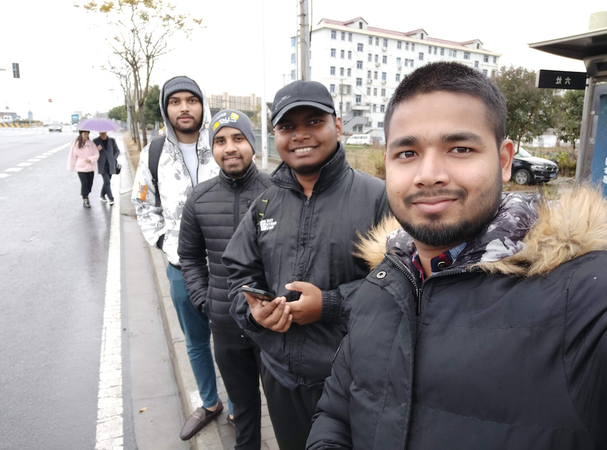
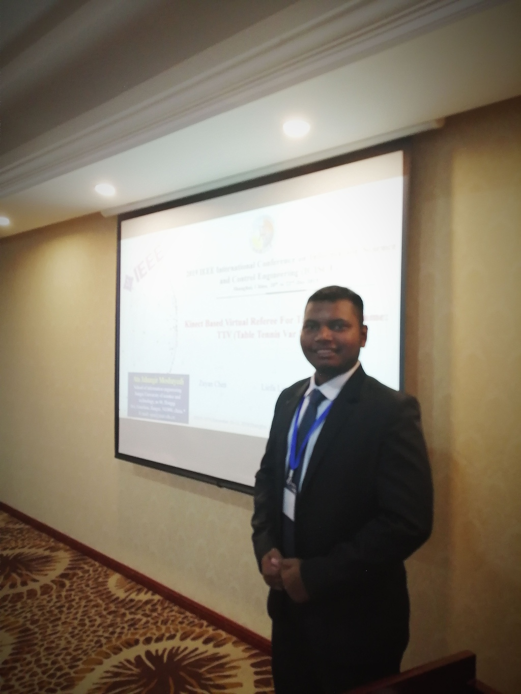
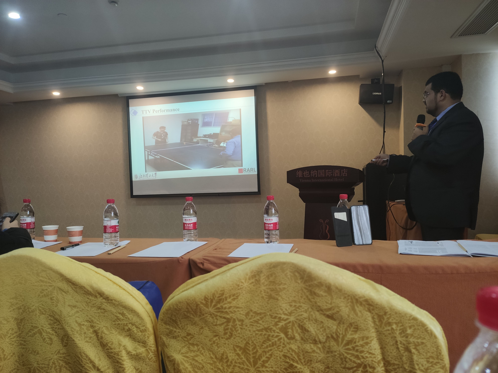
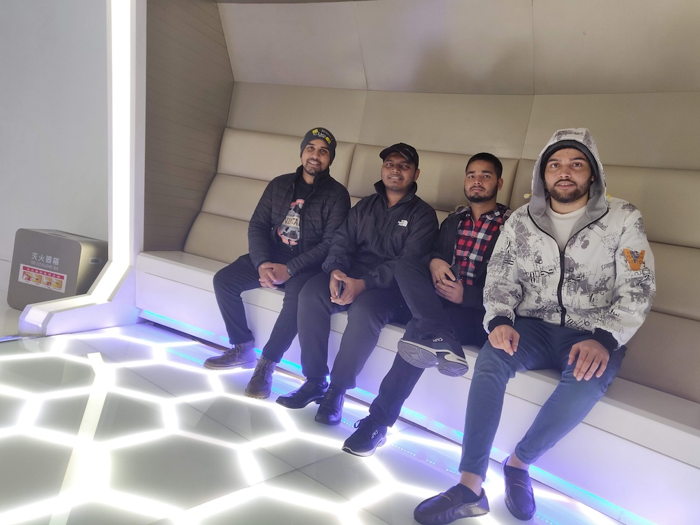
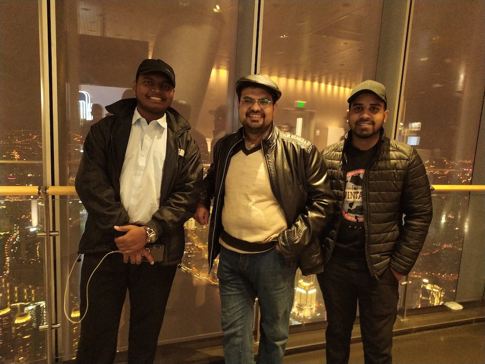
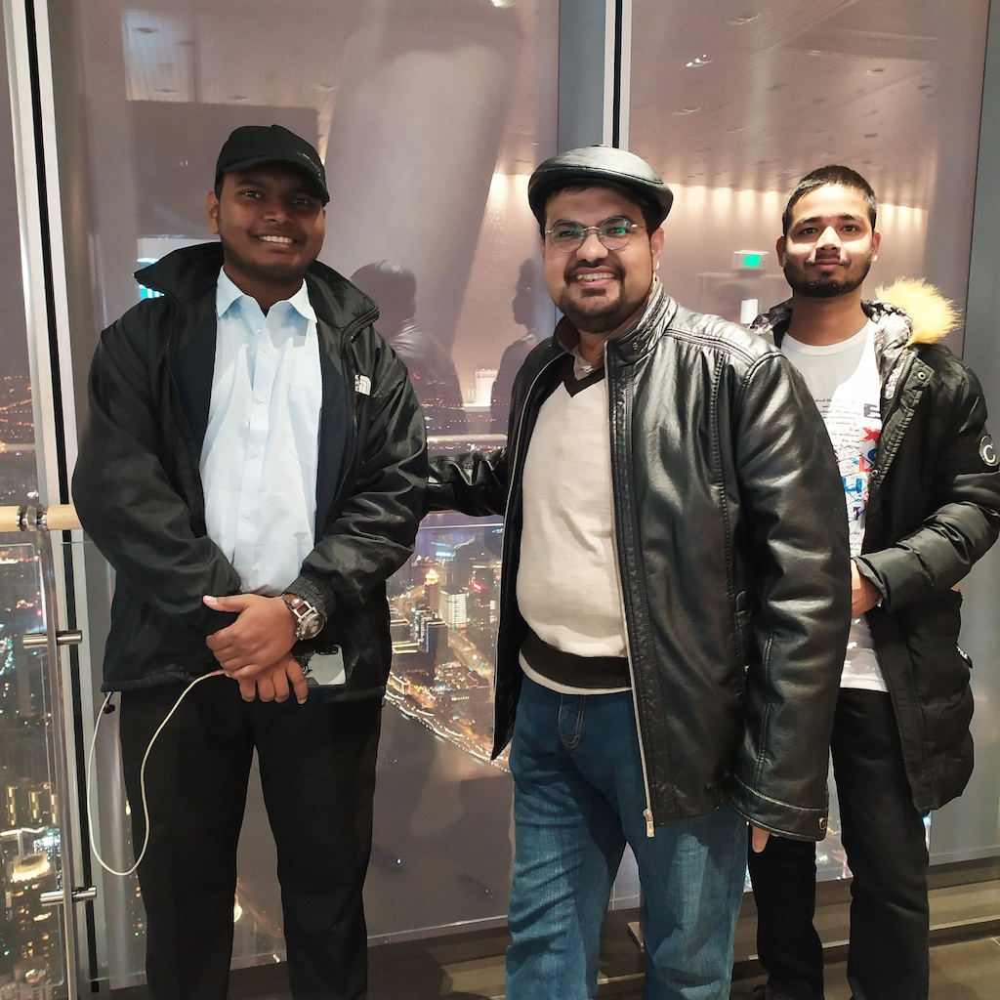
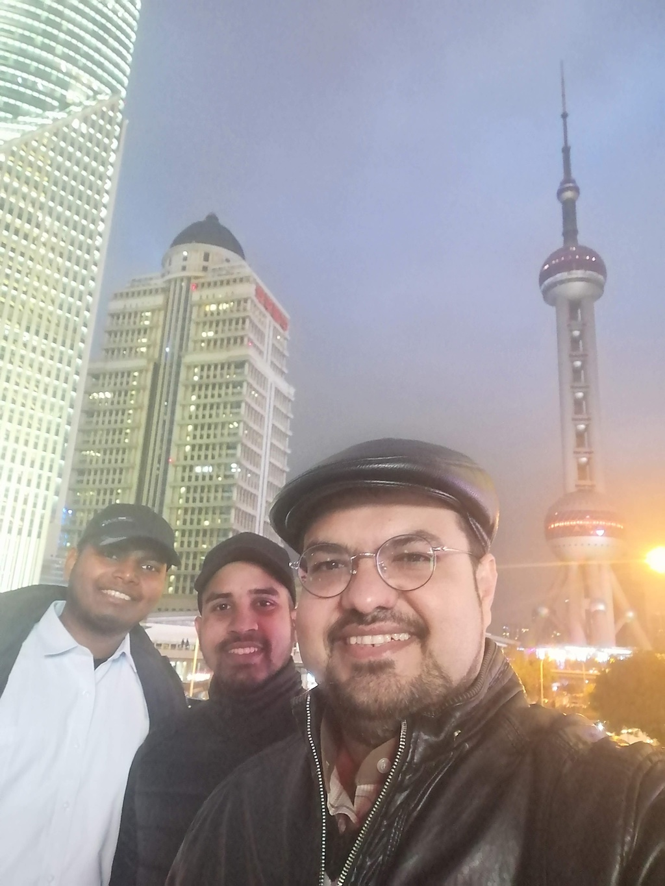
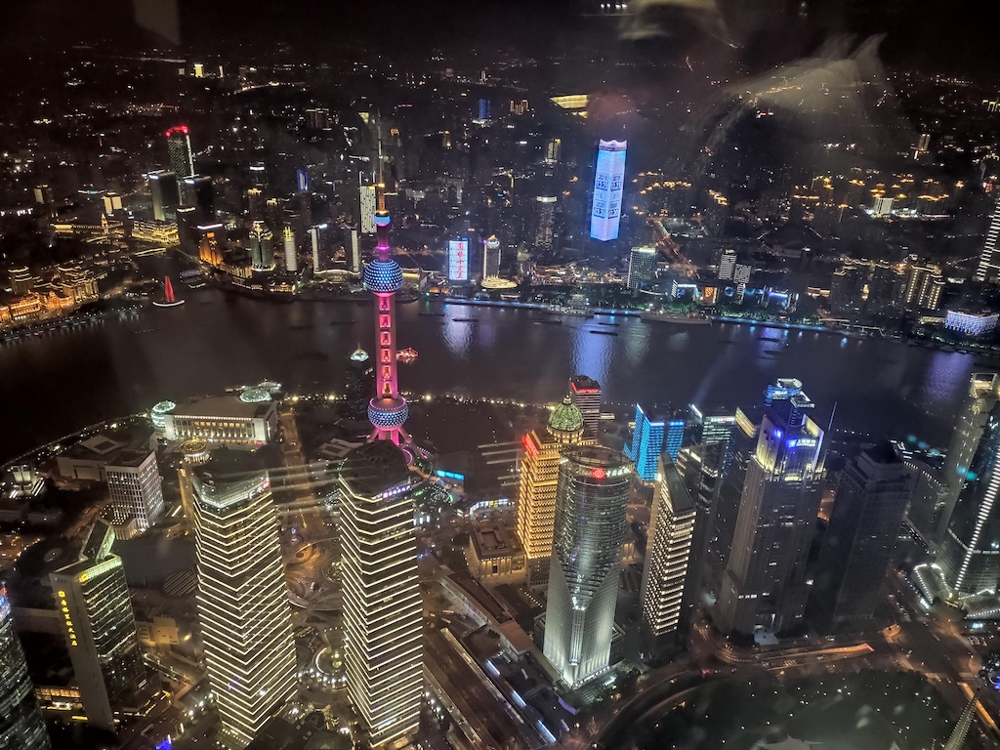

'Just pack up and go' - Never believed in this till this conference. My professor Dr Ata Jahangir Moshayedi had already left a few days ago. And this was my first paper. He was going to present there regardless I manage to go or not. And this was right before COVID-19 (Still did not know that not just an epidemic rather a pandemic is gonna strike soon).

Nevertheless, I simply stood up and told my roommate that wanna go ? - Knowing very well that neither him nor me have any money in our pockets. So, we did what any sane person would do. We convince two more friends who were also broke and took loan from other friends, booked ticket and embarked on a journey. 

We booked a cheap yet surprisingly cute hotel (probably because it was beside Disneyland Shanghai) and our 3 day trip started. 

The day after we had reached was my conference. I went and met up with my professor. As we write in academic articles, the following figure 1 depicts my first conference presentation. Sorry for the lame pun.

So, let's talk a bit about the paper I presented. The name of the paper was - Raspberry Pi SCADA Zonal based System for Agricultural Plant Monitoring. This research paper explores how combining SCADA (Supervisory Control and Data Acquisition) and DCS (Distributed Control System) in the context of IoT can benefit small industries, especially in agriculture. The goal is to make SCADA systems more compact, cost-effective, and secure.

We had designed two small SCADA systems for agricultural applications, focusing on reducing size and addressing security challenges. What's interesting is that they used Raspberry Pi, a tiny computer, instead of traditional PCs or laptops. This not only cuts down costs but also makes the entire system more efficient. We successfully created a web-based SCADA system for monitoring agricultural environments, both locally and remotely, using a network of Raspberry Pi devices. The key idea here is to have a zonal approach, ensuring secure sensor monitoring without external interference.

My professor also presented his paper with another student, Zuyan Chen named - Kinect Based Virtual Referee For Table Tennis Game: TTV (Table Tennis Var System)

Have a look at that paper here - https://ieeexplore.ieee.org/abstract/document/9107693

After the conference we set out to roam the city. And I have got to tell you it was marvelous. The 3 shanghai towers were fantastic. We went to the absolute top of it and the whole city looked amazing from up there. Here are a few photos from out trip for you folks.

")